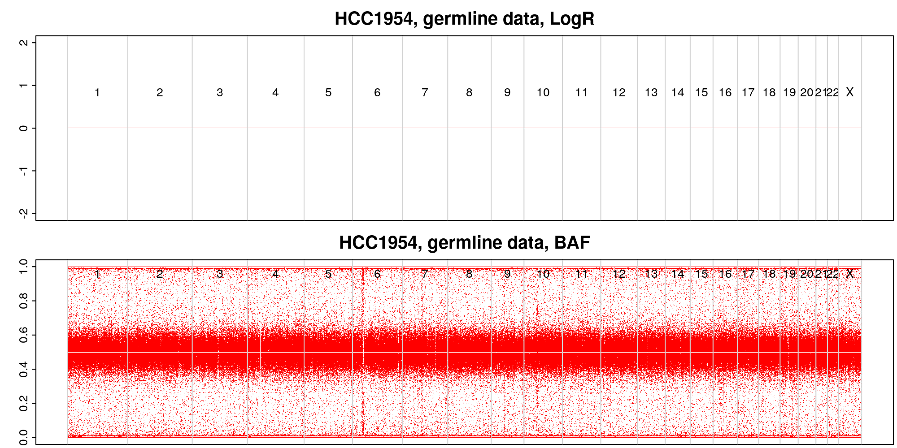
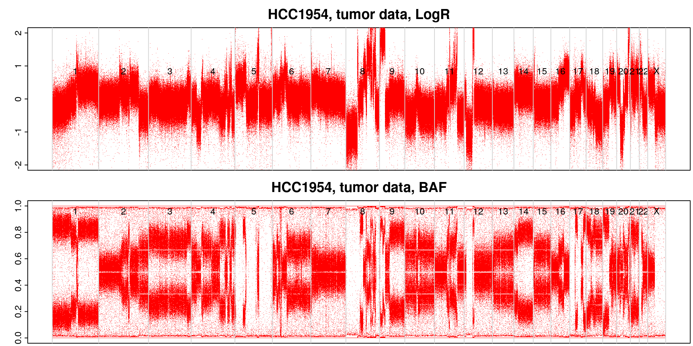
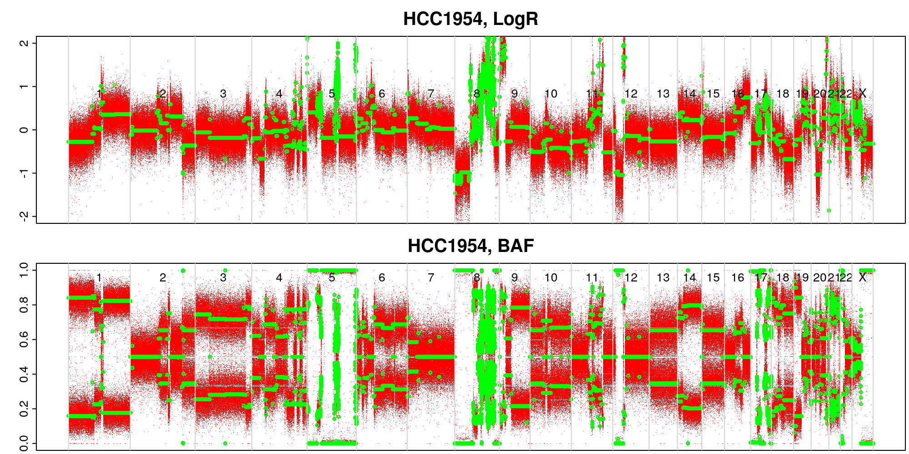
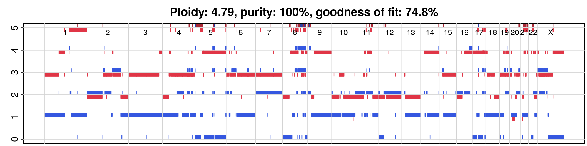

```{r setup, include=FALSE}
library(learnr)
knitr::opts_chunk$set(echo = FALSE)
tutorial_options(exercise.timelimit = 180)
options(tutorial.storage = list(

  # save an arbitrary R object "data" to storage
  save_object = function(tutorial_id, tutorial_version, user_id, object_id, data) {
  
  },
  
  # retreive a single R object from storage
  get_object = function(tutorial_id, tutorial_version, user_id, object_id) { 
    NULL 
  },
  
  # retreive a list of all R objects stored
  get_objects = function(tutorial_id, tutorial_version, user_id) { 
    list() 
  },
  
  # remove all stored R objects
  remove_all_objects = function(tutorial_id, tutorial_version, user_id) {
  
  }
))
```

```{css echo=FALSE}
@media print {
  .topicsContainer,
  .topicActions,
  .exerciseActions .skip {
    display: none;
  }
  .topics .tutorialTitle,
  .topics .section.level2,
  .topics .section.level3:not(.hide) {
    display: block;
  }
  .topics {
    width: 100%;
  }
  .tutorial-exercise, .tutorial-question {
    page-break-inside: avoid;
  }
  .section.level3.done h3 {
    padding-left: 0;
    background-image: none;
  }
  .topics .showSkip .exerciseActions::before {
    content: "Topic not yet completed...";
    font-style: italic;
  }
}
```


## Introduction

In this practical, we are going to use copy number calling software to generate copy number calls from whole-genome sequencing data. The software is called [ASCAT](https://doi.org/10.1073/pnas.1009843107) (**A**llele-**S**pecific **C**opy number **A**nalysis of **T**umours), and the sequencing data comes from a breast cancer cell line (HCC1954) that was sequenced by the Cancer Cell Line Encyclopedia (CCLE), and an immortalised normal blood cell line from the same patient.

## Task 1: From BAMs to LogRs and BAFs

```{r load-logr-bafs, echo=FALSE}
library(ASCAT)
load('data/docs/RData_objects/LogR_BAFs.RData')
```
```{r load-logr-bafs-corrected, echo=FALSE}
library(ASCAT)
load('data/docs/RData_objects/LogR_BAFs_corrected.RData')
```
```{r load-segmented, echo=FALSE}
library(ASCAT)
load('data/docs/RData_objects/segmented_data.RData')
```
```{r load-copy-number, echo=FALSE}
library(ASCAT)
load('data/docs/RData_objects/copy_number.RData')
```

### Exercise 

Unfortunately the BAM files required are over 1 TiB, so I have run this step for you. For reference, the command used to run this step is:

```{r prepareHTS, eval=FALSE, echo=TRUE, highlight=TRUE}

library(ASCAT)

ascat.prepareHTS(
  tumourseqfile     = 'data/G31860.HCC1954.6.bam',
  normalseqfile     = 'data/G31860.HCC1954BL.1.bam',
  tumourname        = 'HCC1954',
  normalname        = 'HCC1954_normal',
  allelecounter_exe = 'alleleCounter',
  alleles.prefix    = 'data/reference_data/G1000_alleles_hg19/G1000_alleles_hg19_chr',
  loci.prefix       = 'data/reference_data/G1000_loci_hg19/G1000_loci_hg19_chr',
  gender            = 'XX',
  genomeVersion     = 'hg19'
  )

```

### Questions
One of the files that is output from the `prepareHTS` command can be inspected using the code below. Use `read.table` to look at the other outputs too.

What do the values in these files mean? How do you think they were calculated?

```{r test, exercise=TRUE, exercise.eval=FALSE, exercise.lines=10}

Sys.sleep(5)

```


```{r allele-count-view, exercise=TRUE, exercise.eval=FALSE, exercise.lines=10}
read.table('data/input/allele_counts/HCC1954_alleleFrequencies_chr22.txt',
           header = TRUE,
           comment.char = '')[105:110,]

read.table('data/input/allele_counts/HCC1954_normal_alleleFrequencies_chr22.txt',
           header = TRUE,
           comment.char = '')[105:110,]

```

```{r logr-baf-view, exercise=TRUE, exercise.eval=FALSE}
read.table('data/input/HCC1954_tumourLogR.txt',
           header = TRUE,
           nrows = 5)

read.table('data/input/HCC1954_tumourBAF.txt',
           header = TRUE,
           nrows = 5)

```


## Task 2: Loading and inspecting the LogR/BAF data

The next step is to load the LogR and BAF values into R. We will also inspect the data by plotting it to get an idea of what it looks like.

It may take a couple of minutes for the data to load.

### Exercise

```{r logr-baf-load, exercise=TRUE, exercise.eval=FALSE}
suppressMessages(library(ASCAT))

LogR_BAFs <-
  ascat.loadData(
    Tumor_LogR_file    = 'data/input/HCC1954_tumourLogR.txt',
    Tumor_BAF_file     = 'data/input/HCC1954_tumourBAF.txt',
    Germline_LogR_file = 'data/input/HCC1954_normalLogR.txt',
    Germline_BAF_file  = 'data/input/HCC1954_normalBAF.txt',
    gender             = 'XX',
    genomeVersion      = 'hg19'
  )

str(LogR_BAFs, max.level = 1)
```

```{r logr-baf-plot, exercise=TRUE, exercise.eval=FALSE, exercise.setup="load-logr-bafs"}
dir.create('~/practical/raw_LogR_BAF_plots')

ascat.plotRawData(
  ASCATobj = LogR_BAFs,
  img.dir  = '~/practical/raw_LogR_BAF_plots'
  )
```

You will see the plots appear as `.png` files in the `raw_LogR_BAF_plots` directory. Each red dot represents a SNP locus.

<div id="logr-baf-plot-hint">
{width=100%}
{width=100%}
</div>

### Questions

Is there anything notable about this sample that you can already see just by plotting the LogR and/or BAF values?


## Task 3: Correcting for GC bias and replication timing

*GC bias* refers to the effect on read depth seen in regions of the genome where the percentage of bases that are G or C (*GC content*) is particularly high or low. In general, regions with high or low GC content have lower read counts.

*Replication timing* refers to the phenomenon that replication of DNA takes place in a set temporal order across the genome, i.e. some segments will always be replicated earlier than others. Early replicating segments have higher read depth than late replicating segments.

Because GC bias and replication timing both influence the read depths measured during sequencing, and therefore the log ratios we have generated, we need to correct our LogR values to account for these biases.

We can do this in the `ASCAT` package by using files that contain the GC content and replication timings of the reference genome.

### Exercise

```{r logr-baf-correction, exercise=TRUE, exercise.eval=FALSE, exercise.setup="load-logr-bafs"}
LogR_BAFs_corrected <- 
  ascat.correctLogR(
    ASCATobj = LogR_BAFs,
    GCcontentfile = 'data/reference_data/GC_G1000_hg19/GC_G1000_hg19.txt',
    replictimingfile = 'data/reference_data/RT_G1000_hg19/RT_G1000_hg19.txt'
  )
```

```{r logr-baf-correction-plot, exercise=TRUE, exercise.eval=FALSE, exercise.setup="load-logr-bafs-corrected"}
dir.create('~/practical/corrected_LogR_BAF_plots')

ascat.plotRawData(
  ASCATobj = LogR_BAFs_corrected,
  img.dir  = '~/practical/corrected_LogR_BAF_plots'
  )
```

<div id="logr-baf-correction-plot-hint">
{width=100%}
</div>

### Questions
Given the information about GC bias and replication timing above, can you form a hypothesis about what will be wrong with the copy number calls of a segment if it has high GC content and is late replicating (if we don't perform the appropriate corrections)?


## Task 4: Fitting segments with constant copy number

The data we have so far gives us some idea about the copy number at approximately 2.5 million individual loci. We want to group these loci into regions of the genome where the copy number is constant. These regions are called *segments*, and so the process of grouping these loci together is called *segmentation*. ASCAT uses allele-specific piecewise constant fitting (ASPCF) to achieve this.

### Code

Again, this code takes a few minutes to run, so we will load the pre-computed result. The command used would be:

```{r segmentation, eval=FALSE, echo=TRUE, highlight=TRUE}
dir.create('~/practical/segmentation_output')

segmented_data <-
  ascat.aspcf(
    ASCATobj = LogR_BAFs_corrected,
    out.dir  = '~/practical/segmentation_output'
)
```

```{r segmentation-plot, exercise=TRUE, exercise.eval=FALSE, exercise.setup="load-segmented"}
dir.create('~/practical/segmentation_plots')

ascat.plotSegmentedData(
  ASCATobj = segmented_data,
  img.dir  = '~/practical/segmentation_plots'
)
```

<div id="segmentation-plot-hint">
{width=100%}
The green lines represent the segments of constant copy number that ASCAT's ASPCF has generated.
</div>

### Questions

Looking at the segmentation plot, can you identify any regions that you can presume have loss of heterozygosity (LOH), where the segment has lost one allele and has multiple copies of the other allele?


## Task 5: Estimating copy number values

Finally, we are going to estimate the integer copy number of the segments we have fitted. Normally, ASCAT does this by performing a grid search of combinations of feasible purity and ploidy values. For each combination, a copy number profile is calculated, and this profile has non-integer copy number values. A measure of goodness of fit is then calculated using the distance of these copy number values to integers. The purity/ploidy combination with the highest goodness of fit is chosen and its copy number values are rounded to generate the final profile.

However, ASCAT is designed for use on patient tumour samples where purities above ~95% are uncommon, and therefore it drops these solutions in favour of those with lower purity (and higher tumour ploidy). Hence, for this cell line data, we have to provide purity and ploidy values manually. We have taken the ploidy estimate from [Cell Model Passports](https://cellmodelpassports.sanger.ac.uk/passports/SIDM00872).


### Code

Fill in the appropriate purity (`rho_manual`) and ploidy (`psi_manual`) values in the `ascat.runAscat` function, using the information from Cell Model Passports and your knowledge about cell lines.

```{r run-ascat, exercise=TRUE, exercise.eval=FALSE, exercise.setup="load-segmented"}
dir.create('~/practical/copy_number_plots')

copy_number <- ascat.runAscat(
  ASCATobj = segmented_data,
  img.dir  = '~/practical/copy_number_plots',
  rho_manual = ...,
  psi_manual = ...,
  gamma = 1
)
```

<div id="run-ascat-hint">
There are no non-tumour cells in cell line samples.
</div>

```{r run-ascat-plot, exercise=TRUE, exercise.eval=FALSE, exercise.setup="load-copy-number"}
ascat.plotAdjustedAscatProfile(
  ASCAT_output_object = copy_number,
  REF = 'hg19',
  png_prefix = '~/practical/copy_number_plots/max_5_',
  y_limit = 5
)
```

<div id="run-ascat-plot-hint">
{width=100%}
</div>

In the plot, major copy number is shown in red and minor copy number is shown in blue. By default, ASCAT only plots copy numbers up to 5 on its y axis and higher values are truncated, so you should generate another plot with a higher `y_limit` to really see what is going on.

```{r run-ascat-plot-higher, exercise=TRUE, exercise.eval=FALSE, exercise.lines=6, exercise.setup="load-copy-number"}
ascat.plotAdjustedAscatProfile(
  ...
  
  
  
)
```

### Questions

Looking at the final copy number profile of the cell line, what features do you think are particularly important? Why?

Homozygous deletions (both alleles deleted, total copy number 0) are of particular functional importance in cancer, because they can completely remove tumour supressor genes. Using the `copy_number` object you have generated, can you identify any regions of homozygous deletion?

```{r find-homdels, exercise=TRUE, exercise.eval=FALSE, exercise.lines=6, exercise.setup="load-copy-number"}
head(copy_number$segments)
```


## Extension work

### Extension 1

Take another look at the plot showing the raw BAF values for the normal sample, `raw_LogR_BAF_plots/HCC1954.germline.png`.

{width=100%}

Which of the SNPs shown in this plot are useful for copy number analysis, and which aren't? Why?


### Extension 2

*ERBB2* (a.k.a. *HER2*) amplification is an important copy number feature that is critical in deciding the appropriate treatment for a patient with breast cancer. Using the `copy_number` object you have generated, does this cell line have an *ERBB2* amplification?

```{r find-erbb2, exercise=TRUE, exercise.eval=FALSE, exercise.lines=6, exercise.setup="load-copy-number"}
head(copy_number$segments)
```

<div id="find-erbb2-hint">
You will need to look up the coordinates of the *ERBB2* gene in the HG19 (aka GRCh37) version of the genome. [Ensembl](https://grch37.ensembl.org/index.html) might be a good place to look.
</div>

<!-- Saving .RData objects in case of any problems running things -->

```{r eval=FALSE, include=FALSE}
save(LogR_BAFs, file = 'data/docs/RData_objects/LogR_BAFs.RData')
save(LogR_BAFs_corrected, file = 'data/docs/RData_objects/LogR_BAFs_corrected.RData')
save(segmented_data, file = 'data/docs/RData_objects/segmented_data.RData')
save(copy_number, file = 'data/docs/RData_objects/copy_number.RData')
```
`